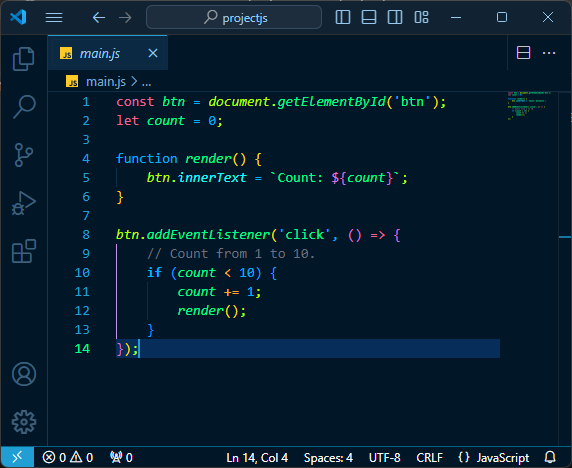

# Resh

This extension for Visual Studio Code adds a dark theme titled "Resh Blue".

# Resh Blue
## JavaScript

# Installation

1. Open **Extensions** from sidebar panel in Visual Studio Code.
1. Search for `Resh`
1. Click **Install**
1. File > Preferences > Color Theme > **Resh Blue**

# Usage

Select Resh Blue from dark themes

# Feedback

If you have any feedback, please open an [issue](https://github.com/RJaco1/vscode-theme-resh/issues) or a [pull request](https://github.com/RJaco1/vscode-theme-resh/pulls).

Be nice

# Author

Authored by Raul Jaco.